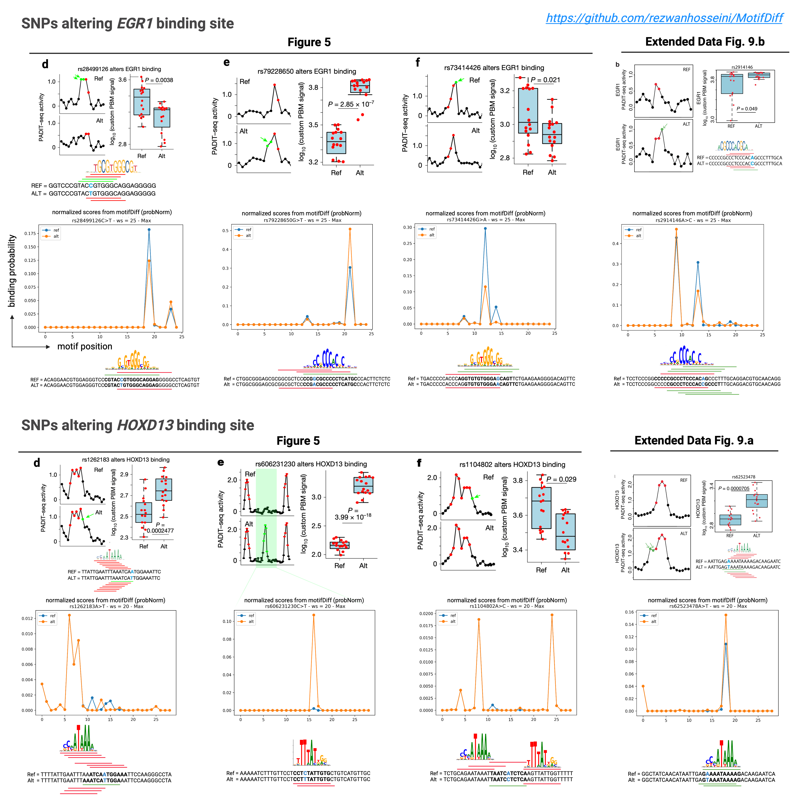

This repository is to test motifDiff (using probNorm method) on some example SNPs mentioned in the [paper](https://www.nature.com/articles/s41586-025-09472-3) introducing PADIT-seq as variants in overlapping low-affinity binding sites of EGR1 and HOXD13 that are not captured by other computational models.

if the variant is available in a vcf format (chr, pos, rsid, ref, alt) the following commands will produce the binding effects:
```
python3 MotifDiff/MotifDiff.py --genome hg38.fa --motif HOCOMOCOv11_full_HUMAN_mono_meme_format.meme --vcf EGR1/rs79228650GtoT.csv --method probNorm --mode average --out EGR1/probNorm_preds/rs79228650GtoT_HUMAN --motname EGR1 --window 25

python3 MotifDiff/MotifDiff.py --genome hg38.fa --motif H14CORE_pfm/H14CORE/pfm/HXD13.H14CORE.0.PS.A.pfm --vcf HOXD13/rs1262183AtoT_HUMAN.csv --method probNorm --mode average --out HOXD13/probNorm_preds/rs1262183AtoT_HUMAN --motname HXD13 --window 20
```

if theere are ref. and alt. sequences around the variant's position (refSeq, altSeq), the following command can be used to produce binding probabilities and for each sequence the difference of which will be the binding effect:
```
# This makes the prediction on Cadps in mm10 as shown in fig. 2.a in PADIT-seq paper
python3 MotifScore/MotifScore.py --motif H14CORE_meme_format.meme --seqs HOXD13/seqs/ --method probNorm --mode average --out HOXD13/probNorm_preds/fig2a
```


